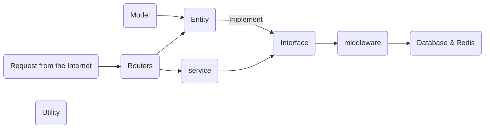

### Quick Look  

```mermaid
flowchart LR
    Z(Model) --> X
    X(Entity) -->|Implement| D(Interface)
    D --> G
    A(Request from the Internet) --> B(Routers)
    B --> X
    B --> C(service)
    F(Utility)
    C --> D
    G(middleware) --> H(Database & Redis)
```
